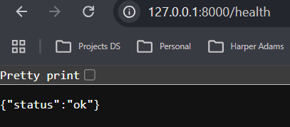
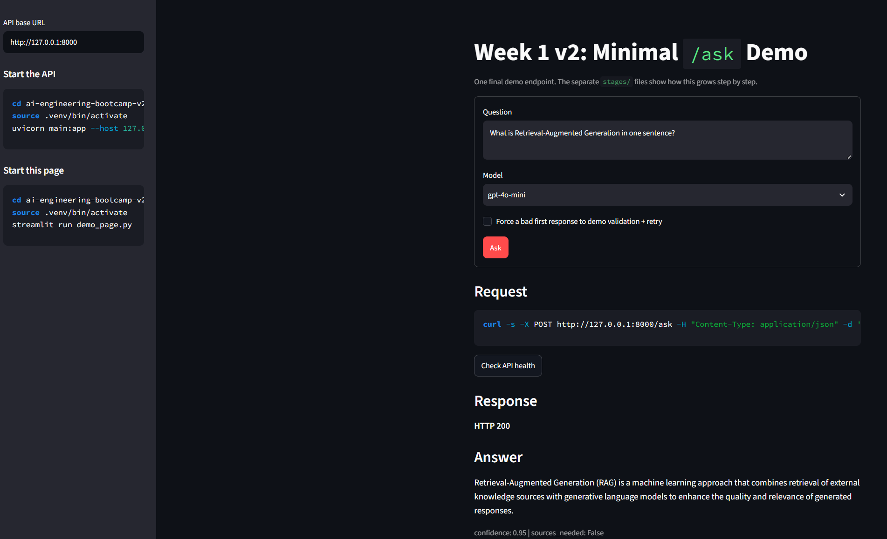
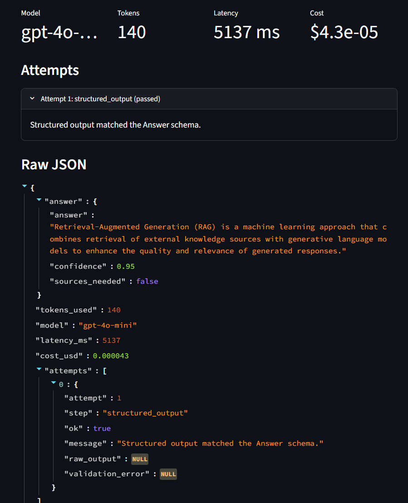

# AI-Enginnering-Bootcamp

This repository contains my AI Engineering bootcamp work, organised week by week.
Below is a concise status update for each week and the next steps I plan to take.

## Week 1 — Typed `/ask` demo (complete)

I built a typed FastAPI `/ask` endpoint plus a small Streamlit UI that demonstrates
structured-model output, validation/retry guardrails, and basic observability.

Artifacts:

- API health check screenshot
	
- Streamlit demo screenshots
	
	

See `ai-engineering-bootcamp-v2/week-1v2/README.md` for usage instructions and
PowerShell-based venv activation steps.

## Week 2 — Retrieval & Vector DBs (in progress)

Work this week focuses on Retrieval-Augmented Generation (RAG) and experimenting
with vector databases. Reference materials and the working notebook live in:

`ai-engineering-bootcamp-v2/week-2/rag-vector-databases/`

### Weekly README guidance

Each week's folder should include a `README.md` that briefly documents what was built,
how to run it, and any important artifacts or next steps. Use this checklist as a template:

- **One-line summary:** What I built this week and why it matters.
- **Quick start:** Minimal commands to create/activate the venv and run the project (PowerShell and Bash variants when relevant).
- **Artifacts:** Screenshots, notebooks, or links to important files produced that week.
- **Tests/smoke checks:** How to run any included smoke tests or sanity checks.
- **Notes / troubleshooting:** Common issues and quick fixes.
- **Next steps/deployment notes:** Short items for follow-up (e.g., deploy to Render.com).

Keeping a consistent weekly `README.md` makes the repository easier to review and
simplifies the final deployment and documentation pass.

