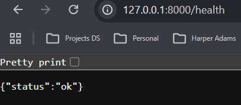
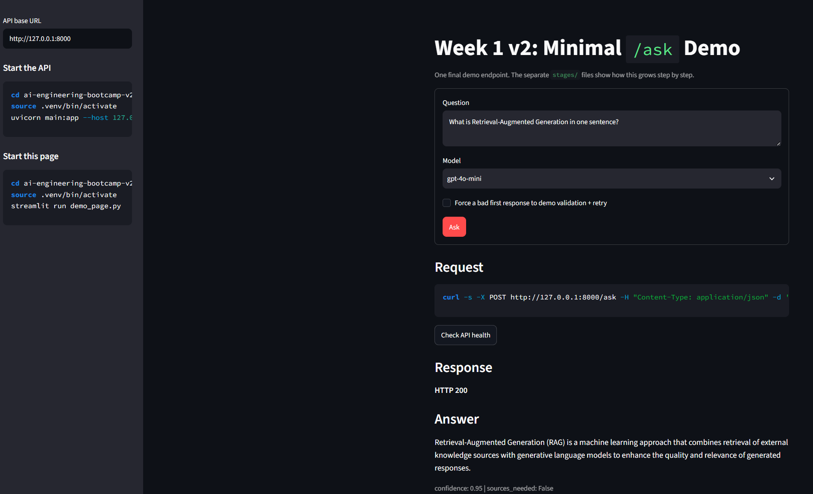
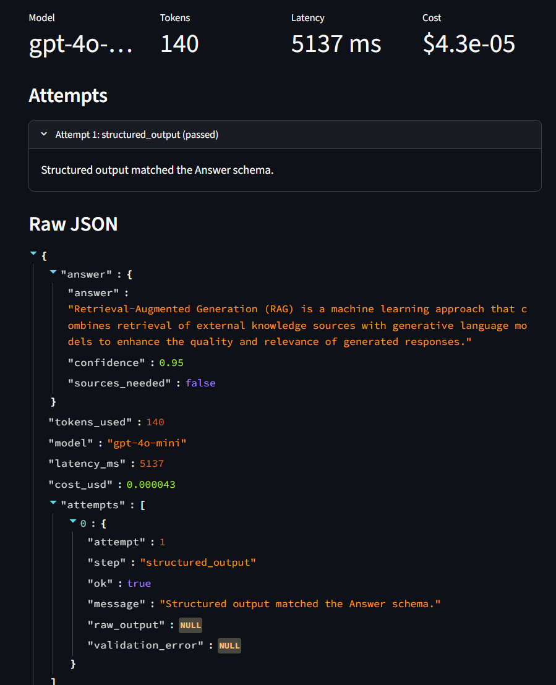
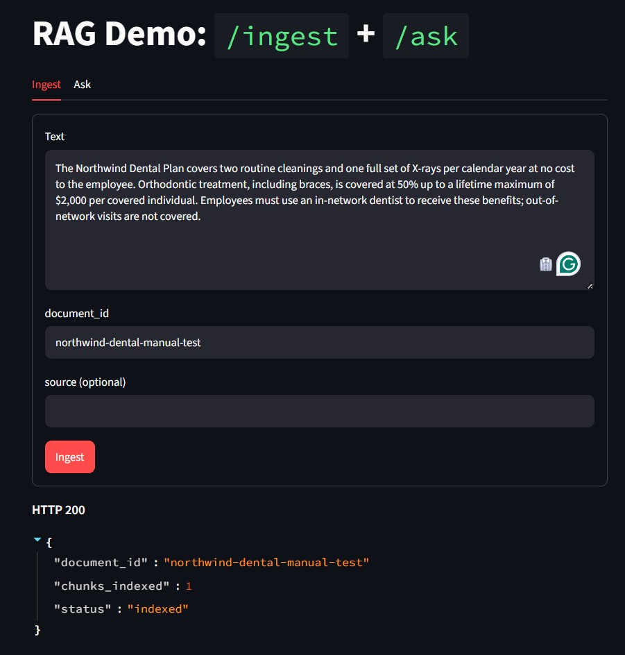
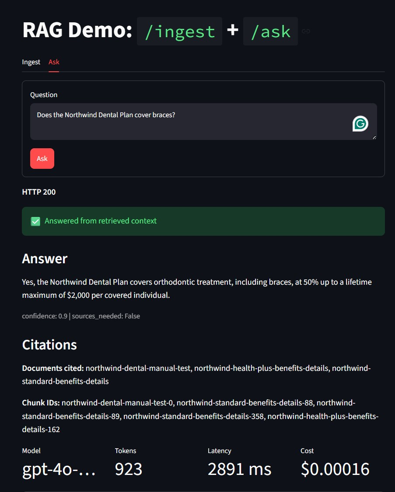
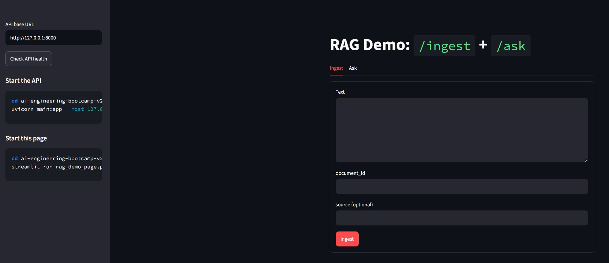
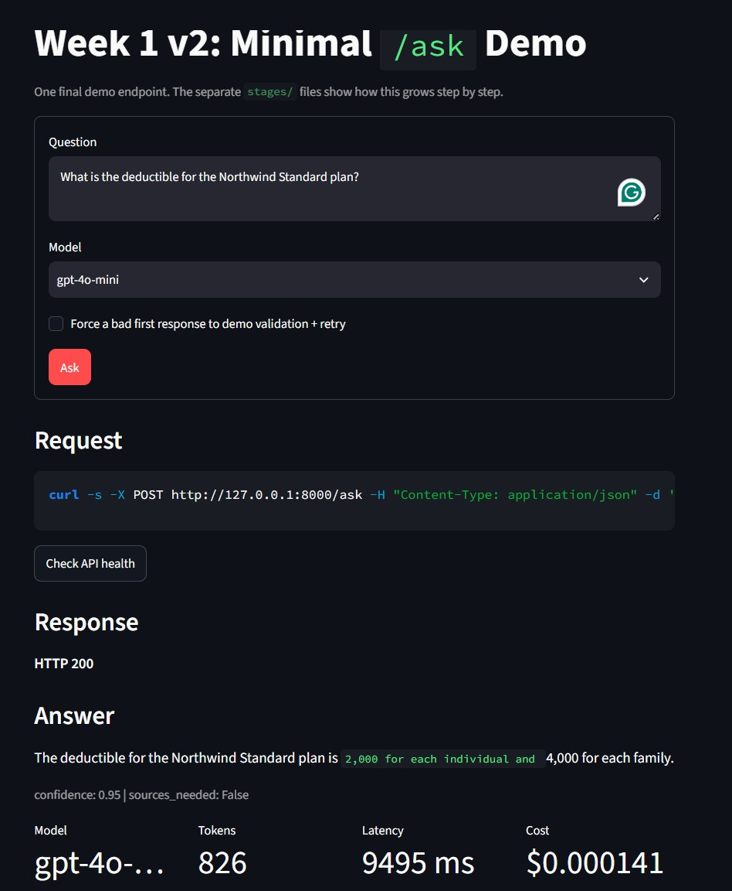
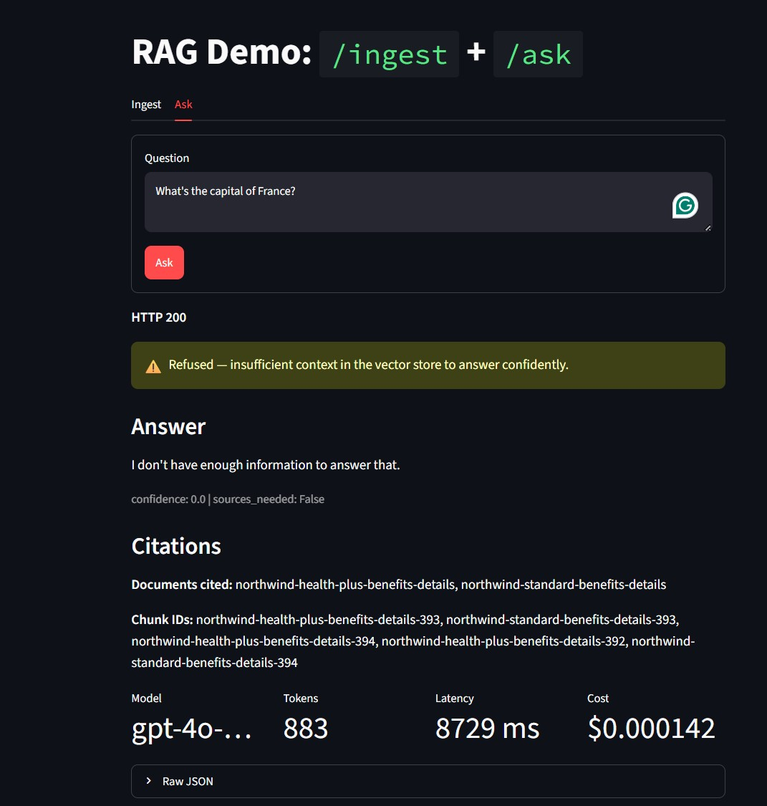
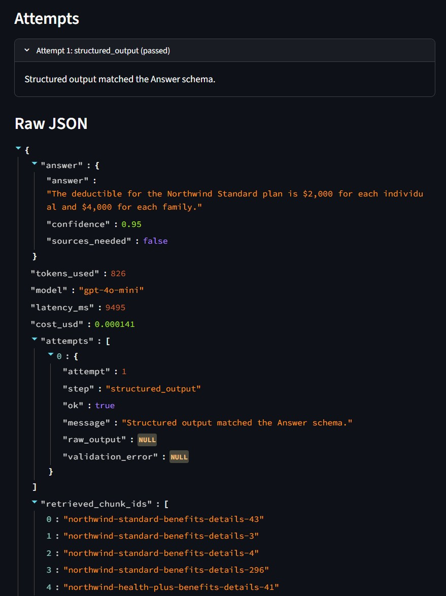
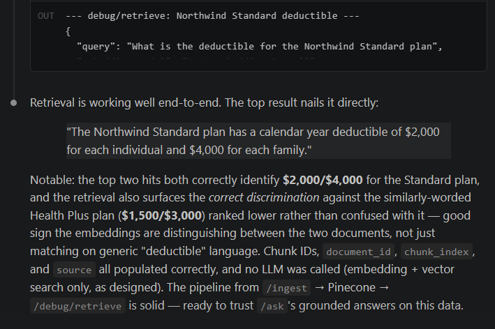

# AI-Enginnering-Bootcamp

This repository contains my AI Engineering bootcamp work, organised week by week.
Below is a concise status update for each week, along with the next steps I plan to take.

## Week 1 — Typed `/ask` demo (complete)

I built a typed FastAPI `/ask` endpoint plus a small Streamlit UI that demonstrates
structured-model output, validation/retry guardrails, and basic observability.

Artifacts:

- API health check screenshot
	
- Streamlit demo screenshots
	
	

See `ai-engineering-bootcamp/week-1/README.md` for usage instructions and
PowerShell-based venv activation steps.

## Week 2 — Retrieval & Vector DBs (complete)

Work this week focused on Retrieval-Augmented Generation (RAG) and experimenting
with vector databases. Reference materials and the working notebook live in:

`ai-engineering-bootcamp/week-2/rag-vector-databases/`

Session 2's RAG extension of the `/ask`/`/ingest` API (Pinecone-backed,
Northwind health-benefits corpus) also lives in `ai-engineering-bootcamp/week-1/` —
see the Deployment section below for live URLs.

## Week 3 — ADK Multi-Agent Systems (in progress)

Building three progressive multi-agent demos with Google's Agent Development Kit
(ADK) in `ai-engineering-bootcamp/adk-multi-agent-systems/`: local-tool routing,
MCP (live database tools), and A2A (agent-to-agent over HTTP). See that folder's
own `README.md` for setup and how to run each demo.

Status (verified 2026-08-02 with real Gemini/Pinecone calls, not just written):
- **Demo 1 (routing)** — adapted from the class starter to my capstone theme
  (Healthcare): a `healthcare_router` root agent delegates to `benefits_agent`,
  `clinical_agent`, and `escalation_agent`, each with their own local-function
  tools (still stub data). Ran end-to-end: all three routes delegate and
  answer correctly. `streamlit_app.py`'s Demo 1 page uses the identical
  agents; app confirmed serving (HTTP 200) with the same theme.
- **`capstone_agent.py`** — single-agent (no router) version of just the
  benefits-coverage job, with a placeholder retrieval tool, step-limited
  (`MAX_STEPS`) Think/Act/Observe logging. Lives in
  `adk-multi-agent-systems/`, kept as the pattern reference.
- **`week-1/adk_agent.py`** (done, verified) — the real version: same
  single-agent pattern, but its retrieval tool calls `vectorstore.query_similar`
  directly, so it queries the actual Northwind Pinecone index — no
  Supabase/MCP needed, since the RAG source is Pinecone, already configured.
  Ran end-to-end with real citations from the ingested PDFs. Lives in
  `week-1/` as a sibling to `main.py`, not a change to the deployed `/ask`
  endpoint.
- **Demo 2 (MCP)** — now real: `claims_agent_mcp` queries a live Supabase
  project via a real `patients`/`claims`/`support_tickets` schema (healthcare-
  themed, same characters as Demo 1's stub data — Bob Smith, Jane Doe, Alice
  Johnson — but real rows in real Postgres). Schema, seed data, and RLS
  (deny-all — flagged by Supabase's own advisor right after table creation,
  fixed immediately) were all set up via the Supabase MCP server's own
  `apply_migration`/`execute_sql` tools. Ran end-to-end with correct real
  answers, both before and after enabling RLS.
- **Demo 3 (A2A)** — same real Supabase claims data as Demo 2, plus local
  tools and the A2A shipping handoff; shipping stays generic (package
  tracking isn't part of the capstone). Ran end-to-end with the shipping
  agent running in a second process — all three routes (claims/technical/
  shipping) answered correctly with real data.
- Getting MCP working required two real fixes: `google-adk` 2.6.1 doesn't
  re-export `McpToolset`/`StdioConnectionParams` from the top-level
  `google.adk.tools.mcp_tool` package (import from submodules instead), and
  the installed `mcp` package (2.0.0) was incompatible with what `google-adk`
  requires (`mcp>=1.24,<2`) — downgraded and pinned in `requirements.txt`.
- **Fixed to get real runs working**: several Gemini model names 404'd or
  hit hard free-tier quota walls on this API key (`"gemini-2.5-flash"`,
  `"gemini-2.5-flash-lite"` 404; `"gemini-2.0-flash"`,
  `"gemini-2.0-flash-lite"` — zero free-tier entitlement;
  `"gemini-flash-latest"` worked but only a 20/day cap) — every ADK file now
  uses `"gemini-3.1-flash-lite"`, a stable pinned model confirmed to have
  working quota. Also fixed a harmless-but-noisy tracing error in
  `healthcare_router.py`/`capstone_agent.py`/`adk_agent.py` caused by returning
  from inside the event stream loop too early.

### Weekly README guidance

Each week's folder should include a `README.md` that briefly documents what was built,
how to run it, and any important artifacts or next steps. Use this checklist as a template:

- **One-line summary:** What I built this week and why it matters.
- **Quick start:** Minimal commands to create/activate the venv and run the project (PowerShell and Bash variants when relevant).
- **Artifacts:** Screenshots, notebooks, or links to important files produced that week.
- **Tests/smoke checks:** How to run any included smoke tests or sanity checks.
- **Notes / troubleshooting:** Common issues and quick fixes.
- **Next steps/deployment notes:** Short items for follow-up (e.g., deploy to Render.com).

Keeping a consistent weekly `README.md` makes the repository easier to review and
simplifies the final deployment and documentation pass.

## Deployment on Render.com
**Live URLs** (two separate Render services — easy to mix up, so labelled explicitly):

| Service | URL | What it is |
|---|---|---|
| **API** (FastAPI) | https://ai-engineering-bootcamp-u7ud.onrender.com | The actual backend. Swagger docs at [`/docs`](https://ai-engineering-bootcamp-u7ud.onrender.com/docs). Endpoints: `/health`, `/ask`, `/ingest`, `/debug/pinecone`, `/debug/retrieve`. |
| **Streamlit UI** | https://ai-eng-bootcamp-5khs.onrender.com | A browser frontend that calls the API above. Has no endpoints of its own — hitting any path (`/health`, `/debug/...`) just returns the Streamlit app shell, not JSON. |

Both are defined in [render.yaml](render.yaml) as `ai-engineering-api` and `ai-engineering-streamlit`, both deploying from the `main` branch, both rooted at `ai-engineering-bootcamp/week-1` (fixed 2026-08-03 — previously pointed at the deleted `ai-engineering-bootcamp-v2/week-1v2` path from before the repo restructure). Feature work happens on a branch (e.g. `add/render-manifest`) and only reaches these live URLs once merged into `main` and pushed — Render doesn't deploy unmerged branches.

- API service (FastAPI)
	- **Root Directory:** `ai-engineering-bootcamp/week-1`
	- **Build Command:** `python -m pip install --upgrade pip setuptools wheel && pip install -r requirements.txt`
	- **Start Command:** `uvicorn main:app --host 0.0.0.0 --port $PORT`
	- **Notes:** I added a nested `Procfile` in the week folder so Render can detect the app when the Root Directory is set.

- Streamlit demo (UI)
	- **Root Directory:** `ai-engineering-bootcamp/week-1` (create a separate Render service pointing to the same folder)
	- **Build Command:** same as API (install requirements)
	- **Start Command:** `streamlit run demo_page.py --server.port $PORT --server.address 0.0.0.0`
	- **Notes:** I added `start_streamlit.sh` to the folder; you can use it as the Start Command (`sh start_streamlit.sh`) or paste the command above. There's also `rag_demo_page.py`, a second Streamlit page for the `/ingest` + `/ask` RAG flow specifically — not wired into `start_streamlit.sh` yet, so it currently only runs locally (`streamlit run rag_demo_page.py`), pointed at the API URL above via the sidebar or `API_BASE_URL` env var.

Common tips:

- Use `0.0.0.0` and `$PORT` (bash-style) in Render start commands. Do not use PowerShell `$env:PORT` in Render settings.
- If a dependency fails to build, upgrade pip/setuptools/wheel in the Build Command (see above).
- The repo includes `runtime.txt` to pin Python to a compatible version on Render.

### Here are a few screenshots of output from week2

